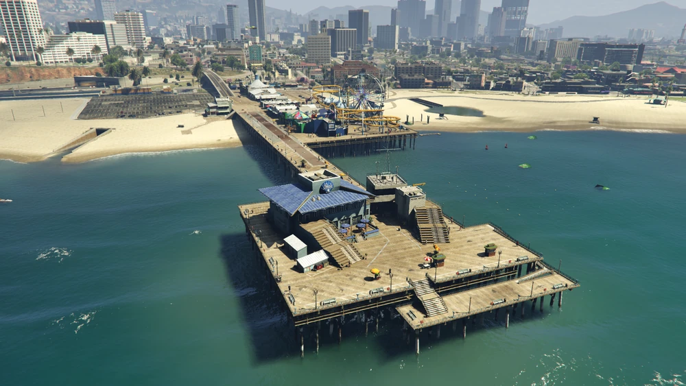
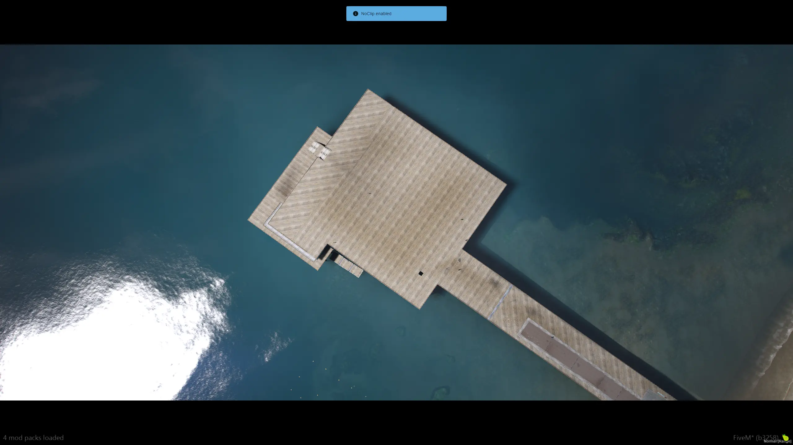
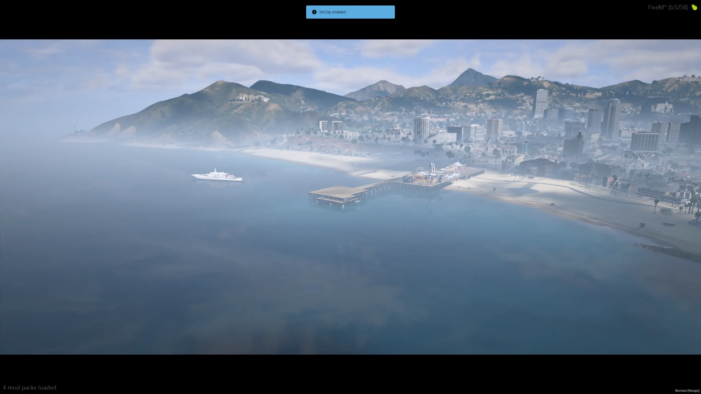
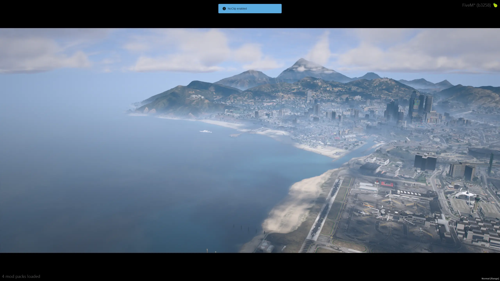
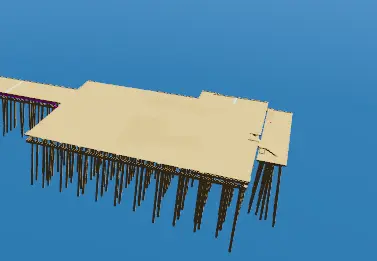

# 🗺️ Cleaned Del Perro Pier - GTA V / FiveM

This is a fully cleaned version of the **Del Perro Pier** area from GTA V, built for **FiveM**.  
The map is intended as a blank, lightweight base for developers and mappers who want to build their own creations without the hassle of removing default elements.

---

## 🚧 Features

- 🧹 Default buildings and props were not deleted, but relocated below the map to keep the area clean 
- 🧱 Collision data has been properly cleaned completely 
- 👁 Occlusions removed  
- 🔍 LODs have been moved below the map and SLODs cleaned and removed
- ⚡ Ready for custom projects

---

## 🛠 Tools Used

- [CodeWalker](https://github.com/dexyfex/CodeWalker)  
- [Blender](https://www.blender.org)  
- [Sollumz](https://github.com/Sollumz/Sollumz)  

---

## 🎯 Purpose

This map is shared to help **developers, roleplay server owners, and creators** who want a clean slate to start with.  
Instead of spending time removing map clutter, you can jump straight into building your own content.

---

## 📦 Installation

1. Place the map folder into your `resources` directory.
2. Add the following line to your `server.cfg`:

   ```bash
   ensure delperro_clean

## 📷 Preview

### 🕰️ Before


### ✨ After

  
*Cleaned Area*

  
*LOD*

  
*SLOD*

  
*Collisions*

📩 Contribute
Feel free to fork the project, open issues, or submit pull requests if you'd like to improve or expand it.
